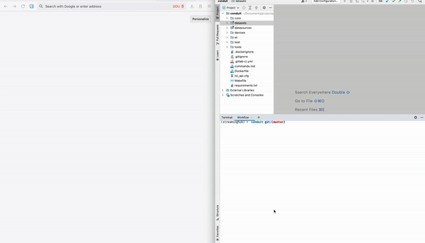

# StreamingHub

<br>
StreamingHub is a framework for developing real-time bio-signal analysis workflows.<br>


It provides the following components:

## DFDS | `dfds/`

JSON schemas to describe data streams, data sets, and analytics, along with a few samples.`<br>`
**Technologies:** JSON, JSON Schema

## PyDFDS | `pydfds/`

A Python package to read DFDS-annotated datasets and their metadata.`<br>`
**Technologies:** Python, Pydantic, JSONSchema, Pydantic

## Curator | `curator/`

A Web interface to annotate files with DFDS metadata and rearranging them in a standard form.`<br>`
**Technologies:** Python, Flask, PyDFDS

## DataMux | `datamux/`

A Python package providing a high-level API to read bio-signal streams.
It supports three modes:
(a) relaying real-time sensory data,
(b) replaying recordings from datasets, and
(c) simulating mock data as test cases.`<br>`
**Technologies:** Python, PyLSL, WebSockets

## FlowMaker | `flowmaker/`

Node-RED addons for using DataMux APIs and visualizing bio-signal data within Node-RED.`<br>`
**Technologies:** Javascript, JSON, Vega

## Repository | `repository/`

A collection of DFDS metadata for commonly used bio-signal datasets and eye-trackers.`<br/>`
**Technologies:** JSON, DFDS

## Examples | `examples/`

A set of real-time bio-signal analysis experiments built upon StreamingHub.`<br/>`
**Technologies:** Python, DataMux, OpenGL

## Archived | `archived/`

An archive of abandoned projects.`<br/>`
**Technologies:** Python, Flask, Angular

## Citation

If you found this work useful in your research, please consider citing us.

```bibtex
@inproceedings{jayawardana2021streaminghub,
author       = {Jayawardana, Yasith and Jayawardena, Gavindya and Duchowski, Andrew T. and Jayarathna, Sampath},
title        = {Metadata-Driven Eye Tracking for Real-Time Applications},
year         = {2021},
isbn         = {9781450385961},
publisher    = {Association for Computing Machinery},
address      = {New York, NY, USA},
doi          = {10.1145/3469096.3474935},
booktitle    = {Proceedings of the 21st ACM Symposium on Document Engineering},
articleno    = {22},
numpages     = {4},
location     = {Limerick, Ireland},
series       = {DocEng '21}
}
@inproceedings {jayawardana2020streaminghub
author       = {Jayawardana, Yasith and Jayarathna, Sampath},
title        = {Streaming Analytics and Workflow Automation for DFDS},
doi          = {10.1145/3383583.3398589},
pages        = {513–514},
location     = {Virtual Event, China},
series       = {JCDL '20},
year         = {2020},
publisher    = {Association for Computing Machinery},
address      = {New York, NY, USA}
}
```
