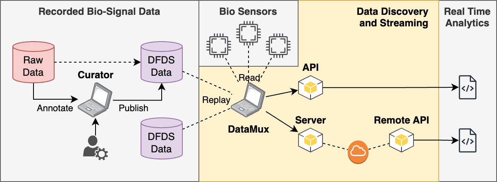

# StreamingHub


When designing, testing, and deploying real-time bio-signal processing algorithms/workflows, we usually run them on multiple data sources to check if they work as expected. StreamingHub makes this process less painful. It provides:

* APIs to access data from different devices and datasets
* Tools to convert existing datasets into open, streaminghub-compatible formats
* An extensible architecture to support new devices as needed



**Main Components**

* **DFDS** (`dfds/`) - JSON schemas to describe data streams, data sets, and analytics, along with a few samples.
* **pyDFDS** (`pydfds/`) - A Python package to read DFDS-annotated datasets and their metadata.
* **Curator** (`curator/`) - A WebApp to annotate files with DFDS metadata and rearrange them into a standard form.
* **DataMux** (`datamux/`) - A Python package providing APIs to proxy live sensor data, replay sensor recordings, and simulate mock data.
* **NodeMux** (`nodemux/`) - Add-on to use DataMux streams in Node-RED workflows
* **BeamMux** (`beammux/`) - Add-on to use DataMux streams in Apache Beam workflows

**Extras**

* **Repository** (`repository/`) - DFDS metadata for common bio-signal devices and datasets
* **Examples** (`examples/`) - Some real-time workflows developed upon streaminghub
* **Archive** (`archived/`) - Project graveyard

# Motivation

When building real-time algorithms and workflows to process bio-signals, how would you feed data into them?

**Case 1 - Reading [Live]() Sensor Data:**
How would you connect to the device?
Once connected, how would you transform the returned data into a usable format?

**Case 2 - Reading [Recorded]() Sensor Data:**
How would you know which columns / fields to read?
If you have many data files with different column/field names, how would you read them all?

# Developer Guide

## Install via micromamba

We recommend using `micromamba` to seamlessly install both python and non-python dependencies.

```bash
# clone the repository
git clone git@github.com:nirdslab/streaminghub.git

# cd into project directory
cd streaminghub/

# install micromamba (recommended)
"${SHELL}" <(curl -L https://micro.mamba.pm/install.sh)

# create an environment with required dependencies
micromamba env create -n streaminghub --file environment.yml

# activate environment
micromamba activate streaminghub
```

## Install via pip

If using `streaminghub` for an existing project, you can directly install the required components via `pip`.

```bash
# clone the repository
git clone git@github.com:nirdslab/streaminghub.git

# install curator (from source)
pip install -e streaminghub/curator

# install pydfds (from source)
pip install -e streaminghub/pydfds

# install datamux (from source)
pip install -e streaminghub/datamux

```

# User Guide

```bash

# install curator (from PyPI)
pip install streaminghub_curator

# install pydfds (from PyPI)
pip install streaminghub_pydfds

# install datamux (from PyPI)
pip install streaminghub_datamux

```bash
# starting streaminghub curator
python -m streaminghub_curator --host=<HOSTNAME> --port=<PORT>

# starting datamux server (for streaming live data)
python -m streaminghub_datamux
```

# Citation

If you found this work useful in your research, please consider citing us.

```bibtex
@inproceedings{jayawardana2021streaminghub,
author       = {Jayawardana, Yasith and Jayawardena, Gavindya and Duchowski, Andrew T. and Jayarathna, Sampath},
title        = {Metadata-Driven Eye Tracking for Real-Time Applications},
year         = {2021},
isbn         = {9781450385961},
publisher    = {Association for Computing Machinery},
address      = {New York, NY, USA},
doi          = {10.1145/3469096.3474935},
booktitle    = {Proceedings of the 21st ACM Symposium on Document Engineering},
articleno    = {22},
numpages     = {4},
location     = {Limerick, Ireland},
series       = {DocEng '21}
}
@inproceedings {jayawardana2020streaminghub
author       = {Jayawardana, Yasith and Jayarathna, Sampath},
title        = {Streaming Analytics and Workflow Automation for DFDS},
doi          = {10.1145/3383583.3398589},
pages        = {513–514},
location     = {Virtual Event, China},
series       = {JCDL '20},
year         = {2020},
publisher    = {Association for Computing Machinery},
address      = {New York, NY, USA}
}
```
