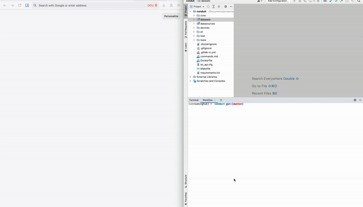

# StreamingHub


StreamingHub is a visual programming framework to simplify data analysis workflows.<br>


## 1 Minute Demo


This repository hosts the following subprojects,

## DFS
A collection of JSON schemas to describe data streams, data sets, and analytics, plus a few samples.<br>
**Technologies:** JSON, JSON Schema

## Conduit
Scripts to stream sensory data in real-time, replay stored data from datasets, and stream mock data for testing.<br>
**Technologies:** Python, PyLSL

## WebUI
Web interface to generate and validate DFS metadata.<br>
**Technologies:** Angular, Typescript, Monaco Editor

## Orange3 Add-ons
Orange3 support package to use StreamingHub.<br>
It adds widgets to discover data streams, display their metadata, and subscribe to them.<br>
**Technologies:** Python, PyQt5, Orange3, PyLSL.

## Node-RED Add-ons
Node-RED support package to use StreamingHub.<br>
It adds widgets to discover data streams, display metadata, auto-populate
**Technologies:** Javascript, JSON, Vega

<hr/>

## Citation
If you found this work useful in your research, please consider citing us.
```bibtex
@inproceedings {jayawardana2020streaminghub
author       = {Jayawardana, Yasith and Jayarathna, Sampath},
title        = {Streaming Analytics and Workflow Automation for DFS},
doi          = {10.1145/3383583.3398589},
pages        = {513–514},
location     = {Virtual Event, China},
series       = {JCDL '20},
year         = {2020},
publisher    = {Association for Computing Machinery},
address      = {New York, NY, USA}
}
```
