# Usability - Packaging and Pipelining

This document provides step-by-step instructions on creating a streamable dataset using `Curator`, and running a `DataMux` pipeline on its data.

# Introduction

You are given a Python script that (a) defines a real-time analysis pipeline, (b) assigns it one of two data sources, and (c) runs the pipeline. The two data sources are described below.

1. Live data from a `pupil_core` device
2. A recording from the `ADHD_SIN` collection

The Python script looks as follows:

```python
from fixation_detection import IVT
from reporting import LogWriter

import streaminghub_datamux as datamux

if __name__ == "__main__":

    # constants
    dataset = "ADHD_SIN"
    timeout = 30
    screen_wh = (1920, 1080)
    diag_dist = (21, 22)
    freq = 60

    # hyperparameters
    vt = 10

    # setup datamux api
    api = datamux.API()

    streams = api.list_collection_streams(dataset)  # for recorded data (ADHD_SIN)
    # streams = api.list_live_streams("pupil_core")  # for live data (pupil_core)

    # get the first stream
    stream = streams[0]
    datamux.logging.info(stream.attrs)

    # define a transform to map data into (t,x,y,d) format
    preprocessor = datamux.ExpressionMap({
        "t": "float(t)",
        "x": "float(lx + rx) / 2",
        "y": "float(ly + ry) / 2",
        "d": "float(ld + rd) / 2",
    })

    # define pipeline
    pipeline_A = datamux.Pipeline(
        api.attach(stream, transform=preprocessor),
        # IVT(screen_wh=screen_wh, diag_dist=diag_dist, freq=freq, vt=vt, transform=None),
        LogWriter(name="ivt", **stream.attrs),
    )

    # run pipeline
    pipeline_A.run(timeout)
```

This script is configured to read a dataset `ADHD_SIN`. However, this dataset hasn’t been generated yet. In this tutorial, we will first try to generate this dataset using our dataset packaging tool, **Curator,** and then run the above script on the generated dataset.

# Task 1 - Creating a DFDS Dataset

First, open the running instance of Curator ([`https://full-darling-gar.ngrok-free.app`](https://full-darling-gar.ngrok-free.app)) from your web browser.


Curator lets you create *streamable* datasets. Through its UI, you can browse the filesystem, where curator is running on, pick files, define a target format, and generate a streamable dataset. This is particularly useful in lab settings, where raw data is stored in a shared folder, and you want to get transformed data to run some analysis scripts on.

## Selecting Data Files

Let’s first open the `Eye Tracking/ADHD-Audio-Visual-Speech-In-Noise/data` folder from Curator UI. Next, let’s select all files using the checkbox, and click `Add to Dataset` button to add them to a new dataset.

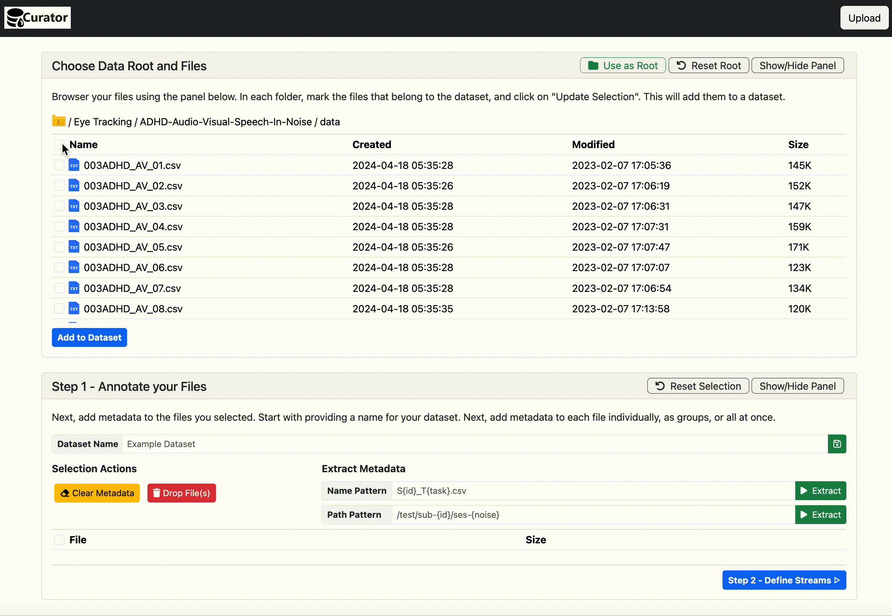

## Setting the Dataset Root

Now, lets pick the current folder as the dataset’s root by clicking the `Use as Root` button at the top. This will get rid of long file paths.

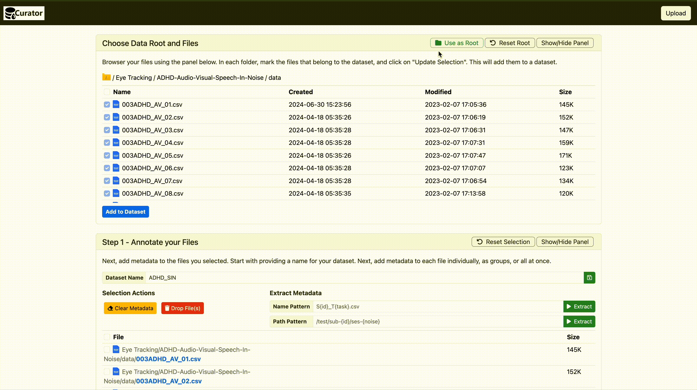

## Setting the Dataset Name

Nice! Let’s specify a name for the dataset. In the **Dataset Name** box, type in `ADHD_SIN` and click on the `save` icon on the right.

## Extracting Metadata from File Names/Paths

Notice that each file is named according to the pattern `<subject>ADHD_AV_<noise><task>.csv`. Their value constraints are given below.

- The **Subject ID** is a three-digit code (e.g., `003`, `004`)
- The **Noise Level** belongs to one of (`0`, `5`, `10`, `15`, `20`, or `25`) dB.
- The **Task Number** is between `1` and `20` (inclusive)

**This information can be easily captured by the regular expression given below.**

```bash
(?P<subject>\d+)ADHD_AV_(?P<noise>0|5|10|15|20|25)(?P<task>\d+)\.csv
```

**Now, let’s use this pattern to extract metadata from file names.** Begin by selecting all files from the table in **Step 1** block.  Now copy-paste the above regular expression into the **Name Pattern** box under **Extract Metadata**, and click on `Extract`. Upon doing so, you will see that Curator has extracted metadata from each file name.

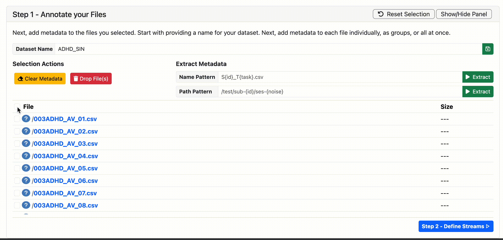

## Identifying Relevant Columns in Data

Now let’s open some files and view their content. For this, you can simply **click on the file names** on either of the tables. This will download the selected file(s) to your computer, where you can view their content. Depending on your web browser, you may either get a download prompt, or the file may download/open immediately.

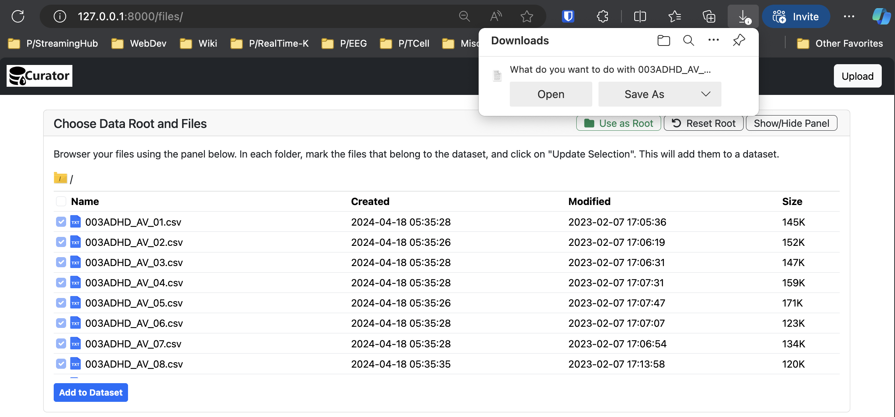

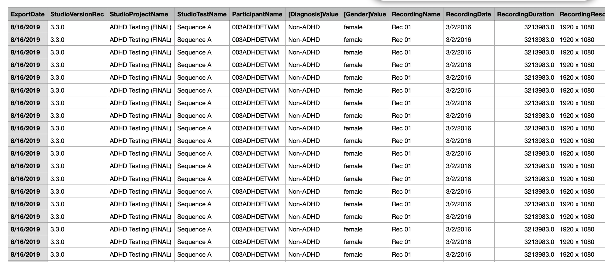

That’s one messy file! Let’s find which columns represent the **gaze positions** and **pupil diameters** of each eye. Take a look at these columns from the file.

1. GazePointLeftX (ADCSpx)
2. GazePointLeftY (ADCSpx)
3. GazePointRightX (ADCSpx)
4. GazePointRightY (ADCSpx)
5. PupilLeft
6. PupilRight
7. RecordingTimestamp

The `GazePointLeftX (ADCSpx)`, `GazePointLeftY (ADCSpx)`, `GazePointRightX (ADCSpx)`, and `GazePointRightY (ADCSpx)` columns indicate which eye (left or right) and axis (x or y) it represents, and that its values are in pixels (`px`). However, the `PupilLeft` and `PupilRight` column names lack the unit information. If you observe the `PupilLeft` and `PupilRight` column values, you will find their values to be in range of `3.0` — `5.0` , which matches human pupil diameter range in `mm` (`2.0` to `8.0`). Hence we can safely assume their values are in `mm`. The `RecordingTimestamp` column gives time information. All data appears to be in 60 Hz (i.e., each file has 60 rows per second).

With this information, let’s move onto the next step by clicking **Step 2 - Define Streams**.

## Defining Data Streams

Now, you’re in the page where you can specify what structure you want the data to be in. Lets first define a stream with the following attributes.

- **ID -** “eye”
- **Name -** “eye movement data”
- **Description -** leave blank
- **Unit** - “pixel, mm”
- **Frequency (Hz)** - “60”

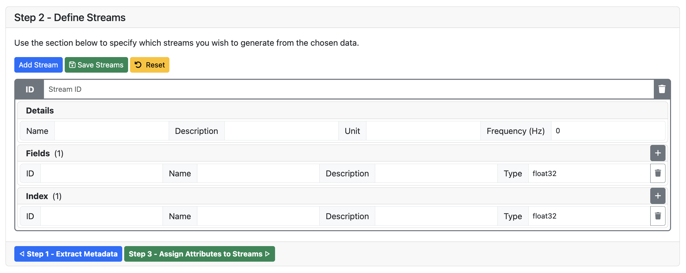

Next, let’s assign a set of **field** values to the **gaze** stream. Use the `+` button to add new fields, and the `trash` button to remove added fields.

- `lx`: **Name** - left gaze point x
- `ly`: **Name** - left gaze point y
- `ld`: **Name** - left pupil diameter
- `rx`: **Name** - right gaze point x
- `ry`: **Name** - right gaze point y
- `rd`: **Name** - right pupil diameter

Next, let’s assign an **index** value to the **eye** stream.

- `t` - **Name** - timestamp

Leave all **description** fields blank. Use float32 for all **type** fields. The final UI will look like follows.

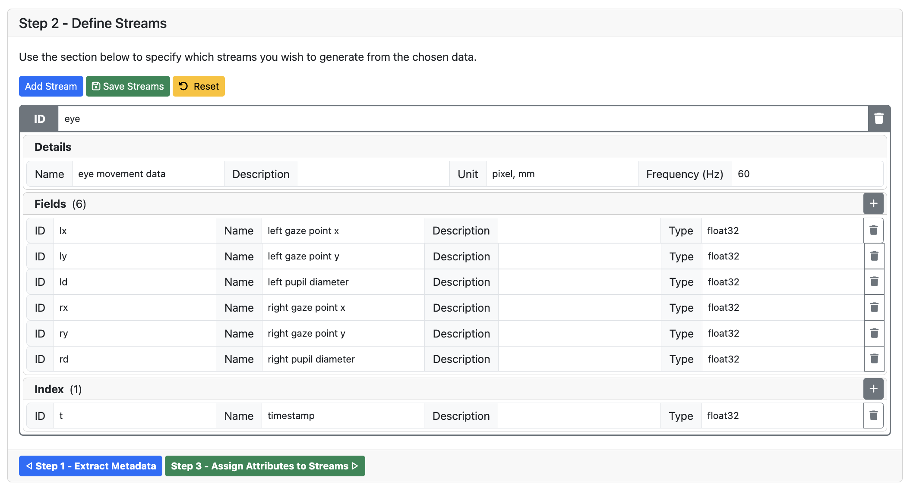

Once done, click the **Save Streams** button to save what you just defined.

<aside>
Note that here, we put both x, y positions (which have `pixel` units) and pupil diameters (which have `mm` units) into the same stream, and set its unit as `pixel, mm`. Alternatively, you could define two separate streams, `gaze` and `pupil`, with `gaze` having `pixel` as unit, and `pupil` having `mm` as unit. Depending on your need, you can pick one format over the other. For the scope of this tutorial, let’s stick to having one `eye` stream.
</aside>

Now, proceed to the next step by clicking on **Step 3 - Assign Attributes to Streams.**

## Assigning Attributes to Streams

Now, you’re in the page where you can pick which columns to assign to the `lx`, `ly`, `ld`, `rx`, `ry`, `rd`, and `t` fields you defined on the last step.

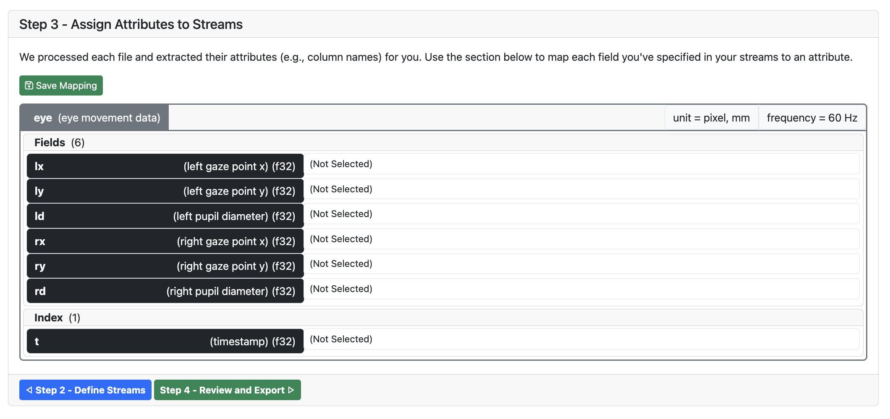

When you click on any `(Not Selected)` box on the right, you are shown a dropdown with the list of columns present in each file.

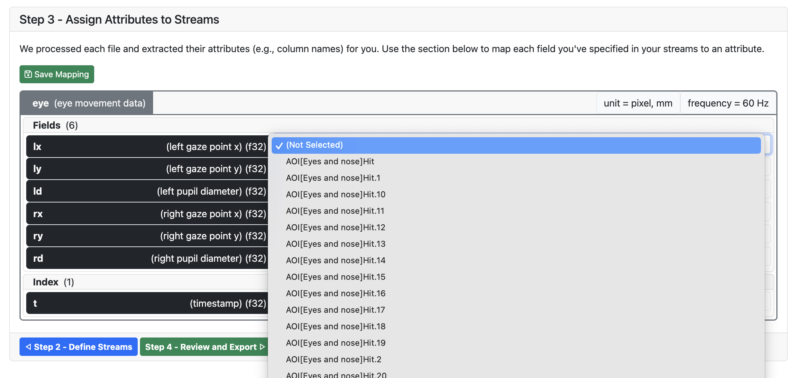

Let’s assign the right columns to each field.

- `lx` - GazePointLeftX (ADCSpx)
- `ly` - GazePointLeftY (ADCSpx)
- `ld` - PupilLeft
- `rx` - GazePointRightX (ADCSpx)
- `ry` - GazePointRightY (ADCSpx)
- `rd` - PupilRight
- `t` - RecordingTimestamp

Once assigned, the UI should look as follows.

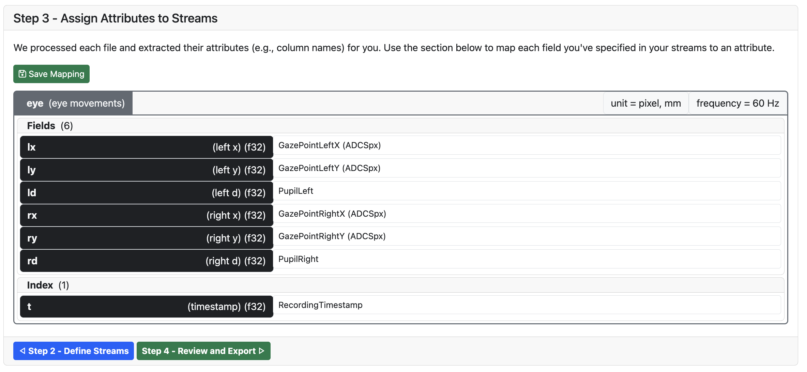

Now, click on the `Save Mapping` button and click on `Step 4 - Review and Export` to proceed to the next step.

## Exporting the Dataset

Now, you’re in the page where you can download the dataset with a file format and indexing pattern of your choice.

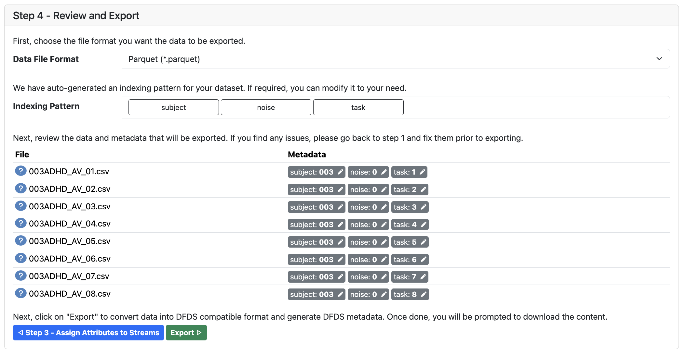

Let’s pick **Parquet** as our file format, and keep the suggested indexing pattern as-is. Now, click on `Export` to download the dataset. Once clicked, allow Curator a minute to generate the dataset and prompt you to download it.

Save this file a folder of your choice. **Do not delete the downloaded tar.gz file yet**, as we will later use that file to stream data.

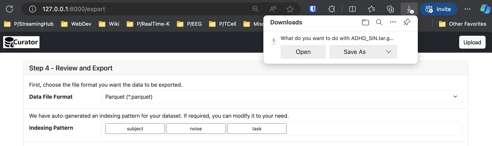

<aside>
 Congratulations! You just created a streamable dataset using Curator.

</aside>

# Task 2 - Running Pipelines on the DFDS Dataset

## Setup

**Step 1: Install Python 3.10,** if you haven’t already.

**Step 2:** Download the starter project from the link below and open it from your Python IDE.

[https://drive.google.com/file/d/1s8t5fbDCUxDI9wBvJeD3uMiXv9RPs2Dn/view?usp=sharing](https://drive.google.com/file/d/1s8t5fbDCUxDI9wBvJeD3uMiXv9RPs2Dn/view?usp=sharing)

**Step 3:** Create a virtual environment, activate it, and install project dependencies.

```python
python -m venv ./venv
source ./venv/bin/activate
python -m pip install -r requirements.txt
```

This will install three packages: `streaminghub-datamux` , `streaminghub-pydfds`, `streaminghub-proxy-pupil-core`, and their required dependencies.

**Step 4:** Create a new directory named `$HOME/streaminghub` and configure the `streaminghub-datamux` package to use that directory.

```html
mkdir -p $HOME/streaminghub
python -m streaminghub_datamux init --data_dir="$HOME/streaminghub" --meta_dir="$HOME/streaminghub"
```

**Step 5:** Now, lets extract the `tar.gz` file you downloaded earlier into the `$HOME/streaminghub` directory. For this, let’s open a terminal in the folder where you downloaded the `tar.gz` file, and run the following command.

```bash
$ tar -zxvf ADHD_SIN.tar.gz -C $HOME/streaminghub
```

Once extracted, your `$HOME/streaminghub` directory should look as follows.

```bash
$ ls -l $HOME/streaminghub

total 8
drwxr-xr-x@ 850 ......  .....  27200 Jun 24 13:30 ADHD_SIN
-rw-r--r--    1 ......  .....   1930 Jun 24 13:30 ADHD_SIN.collection.json
```

## Executing the Pipeline Script

Now, let’s try to stream data from the dataset we just generated. For this, let’s run the previously opened python script (`pipeline.py`) from the terminal.

**Python Script**

```python
from fixation_detection import IVT
from reporting import LogWriter

import streaminghub_datamux as datamux

if __name__ == "__main__":

    # constants
    dataset = "ADHD_SIN"
    timeout = 30
    screen_wh = (1920, 1080)
    diag_dist = (21, 22)
    freq = 60

    # hyperparameters
    vt = 10

    # setup datamux api
    api = datamux.API()

    streams = api.list_collection_streams(dataset)  # for recorded data (ADHD_SIN)
    # stream = api.list_live_streams("pupil_core")  # for live data (pupil_core)

    # get the first stream
    stream = streams[0]
    datamux.logging.info(stream.attrs)

    # define a transform to map data into (t,x,y,d) format and handle missing values
    preprocessor = datamux.ExpressionMap({
        "t": "float(t)",
        "x": "float(lx + rx) / 2",
        "y": "float(ly + ry) / 2",
        "d": "float(ld + rd) / 2",
    })

    # define pipeline
    pipeline_A = datamux.Pipeline(
        api.attach(stream, transform=preprocessor),
        # IVT(screen_wh=screen_wh, diag_dist=diag_dist, freq=freq, vt=vt, transform=None),
        LogWriter(name="ivt", **stream.attrs),
    )

    # run pipeline
    pipeline_A.run(timeout)
```

**Terminal Command**

```bash
$ python pipeline.py
```

Now, you should see a recording from the `ADHD_SIN` dataset being logged on the terminal in a realtime-ish manner, **without having to write any dataset-specific data reading code.**

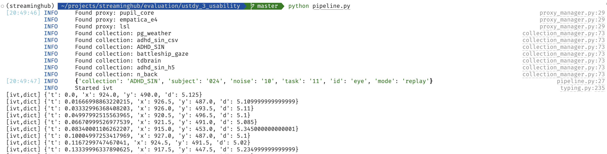

Moreover, the line `datamux.logging.info(stream.attrs)` in our Python script logs any metadata in the selected recording (i.e., `stream`).

```json
{
	"collection": "ADHD_SIN",
	"subject": "024",
	"noise": "10",
	"task": "11",
	"id": "eye",
	"mode": "replay"
}
```

<aside>
 What is the transform=preprocessor doing here?

</aside>

```python
preprocessor = datamux.ExpressionMap({
    "t": "float(t)",
    "x": "float(lx + rx) / 2",
    "y": "float(ly + ry) / 2",
    "d": "float(ld + rd) / 2",
})
```

By default, stream outputs will be passed on as-is. However, if you set the transform to an `ExpressionMap`, this tells `DataMux` to transform data before passing on, and specifies how to. The `ExpressionMap` constructor takes a dictionary as argument, whose keys tell `DataMux` what fields should be generated, and whose values provide `DataMux` an expression to generate them. Each expression is evaluated with all input variables in global scope, and hence, it will output the correct value.

<aside>
 If a `datamux.ExpressionMap` is specified, the next pipeline node will only receive the keys/values specified in it.

</aside>

## Extending the Pipeline Script

Now, let’s uncomment the 2nd step of the pipeline. This turns our script from, a **two-step pipeline** (source → logger), into a **three-step pipeline** (source → algorithm → logger).

**Before**

```python
# define pipeline
pipeline_A = datamux.Pipeline(
    api.attach(stream, transform=preprocessor),
    # IVT(screen_wh=screen_wh, diag_dist=diag_dist, freq=freq, vt=vt, transform=None),
    LogWriter(name="ivt", **stream.attrs),
)
```

**After**

```python
# define pipeline
pipeline_A = datamux.Pipeline(
    api.attach(stream, transform=preprocessor),
    IVT(screen_wh=screen_wh, diag_dist=diag_dist, freq=freq, vt=vt, transform=None),
    LogWriter(name="ivt", **stream.attrs),
)
```

Now, let’s run the pipeline again.

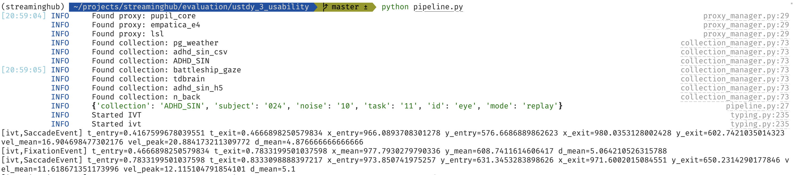

This time, the program logs a different set of values. Compared to the two-step pipeline, the three-step pipeline generates much less values. This is because fixations and saccades are **lossy representations** of eye movement data. However lossy fixation/saccade events may be, they closely resemble a person’s viewing pattern (i.e., process, refocus, process, refocus, … ).

# Bonus Task - Running the Pipeline on Live Data

> **To perform this task, you must connect a pupil core device to your machine.**

To use a live data stream, the code requires only **one** change of variable (`stream`). Doing so switches the pipeline from using recorded data to using live pupil core data.

```python
stream = api.list_live_streams("pupil_core")  # for live data (pupil_core)
# stream = api.list_collection_streams(dataset)  # for recorded data (ADHD_SIN)
```

When switching data sources, beware that the names of measurements may be different from your previous data source. You may need to update the `datamux.ExpressionMap` dictionary **values** (not keys)  to reflect the change in variable names.

The updated `ExpressionMap` for the live data source is provided below.

```python
preprocessor = datamux.ExpressionMap({
    "t": "float(t)",
    "x": "float(eye_l.x + eye_r.x) / 2",
    "y": "float(eye_l.y + eye_r.y) / 2",
    "d": "float(pupil_l.d + pupil_r.d) / 2",
})
```

Now, let’s run the pipeline again. The pipeline can now be run on **actual live data,** simply by making small, straightforward changes to the Python script.

<aside>
 That brings us to the end of this tutorial. Hope you enjoyed using our framework!

</aside>

# Post-Questionnaire

Please complete the user experience questionnaire provided on the link below.
[https://forms.gle/vBx74dV3tTpSo6c8A](https://forms.gle/vBx74dV3tTpSo6c8A)
